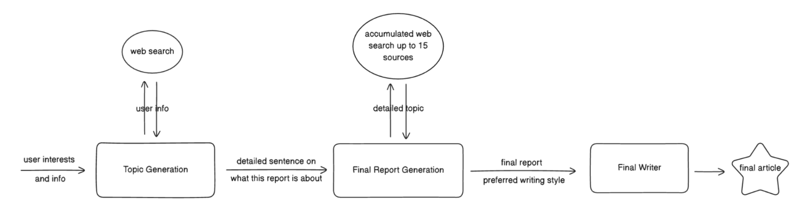

# The Fourth Branch

AI-powered personalized news with radical transparency.

## 🔍 Overview

Fourth Branch is an AI news platform that builds personalized, bias-labeled stories by sourcing, verifying, and visualizing information from across the web. It combines a frontend app, a LangGraph-based agent system, and a structured database.

## ⚙️ Tech Stack

- **Frontend**: Next.js, Typescript, Tailwind CSS
- **Backend**: FastAPI, Python
- **Database**: Supabase(PostgreSQL)
- **LLMs**: LangGraph, Claude4, OpenAI, Gemini
<!-- 
## 📁 Project Structure

/
├── frontend/ # Next.js frontend interface
├── backend/ # API and LangGraph agents
│ ├── agent/ # Core AI pipeline (LangGraph)
│ └── app.py # Backend DB models and endpoints
└── db/ # SQL schema, seed scripts, and migrations -->

## 🧠 Key Folders
frontend/: Next.js-based UI with user interest input, main page and article view.

backend/agent/: Handles the entire news generation process using three AI agents.

db/: SQL scripts and schema for PostgreSQL.

## 💡 News Generation Workflow

## 

UC Berkeley AI Hackathon 2025
